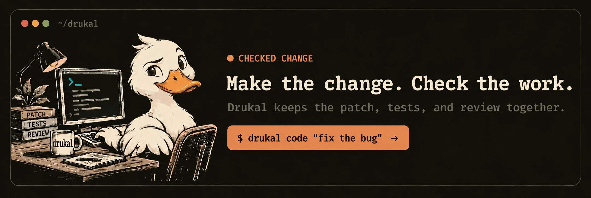

<h1 align="center">Drukal</h1>

<p align="center">
  <a href="https://github.com/keys-i/drukal/actions/workflows/checks.yml"></a>
  <a href="https://crates.io/crates/drukal"></a>
  <a href="https://crates.io/crates/drukal"></a>
  <a href="LICENSE"></a>
</p>

<p align="center">
  
</p>

Drukal helps with the work around a GitHub repo. Ask it about an issue or PR, get a review of your changes, or let it repair a stuck Cargo Dependabot update. You decide what gets merged.

Drukal takes inspiration from the Australian dropbear and the [Kalij pheasant of Jammu and Kashmir](https://kashmirtourismofficial.com/pub/pdf/nature_kashmir_brochure.pdf). The duck stays at the keyboard

## Install

Until the first Drukal release, build a checkout using the instructions below. Cargo and Homebrew installation become available after that release

```sh
cargo install drukal --locked
drukal --help
```

If you use Homebrew

```sh
brew tap keys-i/drukal https://github.com/keys-i/drukal
brew install keys-i/drukal/drukal
```

Or build a checkout with Rust 1.85+

```sh
cargo build --release --locked
target/release/drukal --help
```

Coming from Koelu, Koela, Rady or Pekin? See the [upgrade guide](docs/UPGRADING.md)

## Connect a repository

1. Install the **Drukal** GitHub App for your repository.
2. Read the [Terms](docs/TERMS.md) and [Privacy policy](docs/PRIVACY.md).
3. As a repository administrator, run

```sh
drukal setup --repo owner/repo --check test --accept-terms
```

Setup writes `.github/drukal.toml`, records your agreement in a closed issue, and adds Dependabot config if it is missing. Review and commit the generated files. Service credentials stay in the central service, and setup leaves your branch protection alone.

<details>
<summary>Other setup options</summary>

`drukal dependasolve` runs setup from a script. It configures the repository without starting a PR review.

```sh
drukal dependasolve --repo owner/repo --check test --apply --accept-terms
```

Setup chooses the solver revision. To pin a specific commit, pass `--solver-ref keys-i/drukal@COMMIT_SHA` with a full 40-character commit SHA.

A `.github/drukal.json` configuration with a valid solver pin and agreement is also accepted. Prefer the TOML file written by setup

</details>

## Ask Drukal on GitHub

Start an issue or PR comment with Drukal’s name

```text
@drukal What changed here, and what should I check?
@drukal[bot] Review this line
```

A newline after the name works too, and both `@drukal` and `@drukal[bot]` are accepted. Owners, members and collaborators can send requests. Inline PR questions get a reply in the same thread, using the selected line and diff as context

Conversation mentions in `keys-i/drukal` start a run directly, as do inline mentions on PRs opened from its own branches. Other installed repositories and inline comments on fork PRs use the scheduled scan every five minutes.

## PR reviews and Dependabot repairs

Drukal reviews open PRs that are not drafts, including contributions from forks. It reads GitHub's diffs and CI results without checking out or running PR code. In `keys-i/drukal`, PR events and completed **Checks** or **Security** runs trigger reviews. Scheduled scans rotate through existing PRs in connected repositories.

Unsupported, grouped or ambiguous dependency updates get a `COMMENT` review for you to decide on. A grouped Cargo update can still qualify for an automatic repair.

To let Drukal repair Cargo Dependabot PRs with merge conflicts or failed required checks, enable autofix

```sh
drukal setup --repo owner/repo --check test --autofix --accept-terms
```

This covers verified updates, including signed groups and changes only to `Cargo.lock`, when the full dependency diff fits the repair limit. A failed model review does not stop an eligible repair. Repairs must pass Cargo checks before Drukal opens a replacement PR. The original Dependabot branch stays as it is. You review and merge the replacement.

## Ask for a code change

Post the change you want in an issue or the PR's **Conversation** tab. Drukal records the request and base commit, then asks you to approve it using the request's comment ID.

```text
@drukal[bot] fix the parser error for empty package names
@drukal[bot] approve 123456789
```

The same person must approve the request and still have write, maintain or admin access. Drukal rechecks the request, approval and base commit before starting. It saves completed steps on a `drukal/...` branch and opens one PR for you to review.

<details>
<summary>If a change request stops</summary>

A changed base commit, invalid approval, lost access or failed check stops the request without changing the default branch.

Once a request has started, Drukal does not retry it automatically. If no result appears, check the service's Actions run before submitting another request and approval. Abandoned requests are marked expired after two hours when the service can still find their records in the comment scan.

</details>

## Work locally

```sh
drukal code "fix the parser" --check test
drukal agent ask "where is this parser called?"
drukal agent follow-up RUN_ID "which failure should I fix first?"
```

Use `drukal runs`, `inspect`, `cancel`, `resume` and `apply` to find and control your work. Drukal can load repository guidance, skills and MCP servers. Terminal reports support Markdown, mathematics and accessible themes.

Your request and the applicable `AGENTS.md` set the task, tone and format. Planners and reviewers read files. Workers edit and run checks. Workers cannot commit, publish or send messages. Drukal handles approved publication after checking the result. You can read the instructions for [planning and review](src/delivery/quality.rs), [workers](src/delivery/run.rs), [mentions](src/github/mentions/mod.rs) and [PR reviews](src/github/reviews/model.rs).

## Model choices

Pass `--model-choice` more than once to give Drukal an ordered list, from fast to deep. It plans with the last choice by default, picks a model for each task, and moves up the list when checks or review fail. `--model` overrides the planner model. Hosted runs use `DRUKAL_MODEL_CHOICES` for a comma-separated list supported by their harness.

The Codex harness accepts `hf:namespace/model` choices from [Hugging Face Inference Providers](https://huggingface.co/docs/inference-providers/integrations/codex). Choose a model with tool support and set `HF_TOKEN` with Inference Providers permission. Hosted inference needs available credits. Downloaded public weights can run locally without those credits.

For free hosted answers, set `DRUKAL_OPENROUTER_API_KEY` in the central service's secrets. Private repositories also need `DRUKAL_OPENROUTER_PRIVATE_OK=true`. Drukal tries free Nemotron, then Qwen through [OpenRouter failover](https://openrouter.ai/docs/guides/routing/model-fallbacks). It requires schema support and caps token and request prices at zero. Rate limits and provider availability still apply. With only one provider available, deep answers use one model call.

Hosted edits use Gemini CLI. Models installed only on your Mac are not available to GitHub's hosted runners.

## Privacy and access

GitHub App credentials stay in `keys-i/drukal`. Mention and review tokens can read repository contents, but cannot change them. Tokens are temporary and limited to the installation or repository they need.

Questions and reviews send their issue or PR context to the selected provider. Hosted edits may also send repository files chosen for the task. The provider key is passed only to the model client. It never goes into the repository, prompt or logs.

Hosted editing stops before launch if the repository contains `.gemini`, `.env` or `GEMINI.md`, which could change the harness's configuration. See [Privacy](docs/PRIVACY.md) for the full details.

## More

Read the [changelog](docs/CHANGELOG.md) for the release history, or the [release guide](docs/RELEASING.md) if you maintain Drukal.

To contribute, see [Contributing](.github/CONTRIBUTING.md), the [Code of Conduct](.github/CODE_OF_CONDUCT.md) and [Security](.github/SECURITY.md). The source is [MIT licensed](LICENSE).
